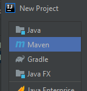
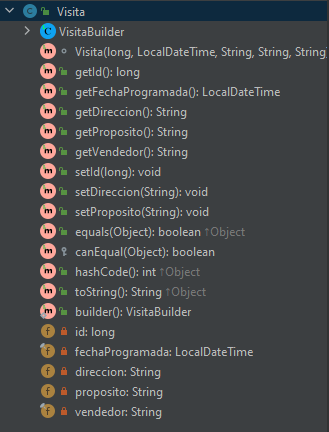

## Ejemplo 1: Creación de getters, setters, constructores, equals y hashcode con @Data

### Objetivo
- Usar las anotaciones básicas de Lombok para la generación de getters, setters, constructores, equals y hashcode.

#### Requisitos
- Tener instalado el IDE IntelliJ Idea Community Edition con el plugin de Lombok activado.
- Tener instalada la última versión del JDK 11 (de Oracle u OpenJDK).
- Tener instalada la herramienta Postman.


#### Desarrollo

1. Crea un proyecto **Maven** desde el IDE IntelliJ Idea. Este proyecto No deberá ser creado con Spring Initilizr.

2. Agrega al proyecto, en el archivo **pom.xml** la dependencia de Lombok 

```xml
    <dependencies>
        <dependency>
            <groupId>org.projectlombok</groupId>
            <artifactId>lombok</artifactId>
            <version>1.18.16</version>
            <scope>provided</scope>
        </dependency>
    </dependencies>
```
3. Crea un nuevo paquete llamado `org.bedu.java.backend.sesion5.ejemplo1` y adentro crea una clase llamada `Principal` que tenga un método `main` de la siguiente forma:
```java
public class Principal {
    public static void main(String[] args) {
        
    }
}
```

4. Crea un subpaquete llamado `model` y adentro de este una clase llamada `Venta`; la estructura de la aplicacion hasta ahora debe verse así:



5. En la clase `Visita` coloca los siguientes atributos, en donde dos de los atributos estan marcados como `final`:
```java
    private long id;
    private final LocalDateTime fechaProgramada;
    private String direccion;
    private String proposito;
    private final String vendedor;
```

6. Decora la clase `Visita` con la anotación `@Data`, la cual le dice a **Lombok** que debe generar una serie de métodos, entre los que se encuentran:
- *getter*s de todos los atributos
- *setter*s de todos los atributos que no sean `final`
- `equals`, `hashcode` y `toString`
- Constructor con todos los atributos final

```java
@Data
public class Visita {
    private long id;
    private final LocalDateTime fechaProgramada;
    private String direccion;
    private String proposito;
    private final String vendedor;
}
```

7. Decora la clase con la anotación `@Builder`, la cual indica a Lombok que debe implementar el patrón **builder** en esta clase, así que automáticamente agregará todos los elementos necesarios, incluyendo un método `build`, que será el que usaremos para obtener una instancia del objeto `VistaBuilder`, el cual también generado automáticamente por Lombok.

```java
@Data
@Builder
public class Visita {
    private long id;
    private final LocalDateTime fechaProgramada;
    private String direccion;
    private String proposito;
    private final String vendedor;
}
```

8. Revisa el panel de estructura de la clase en IntelliJ en donde se muestran los metodos generádos por IntelliJ:



9. En el método `main` crea una nueva inastancia de `Vista`, usando su builder, e imprime sus valores en la consola:
```java
    public static void main(String[] args) {
        Visita visita = Visita.builder().proposito("Presentar los nuevos productos")
                .direccion("Oficina del cliente")
                .fechaProgramada(LocalDateTime.now().plusDays(3))
                .vendedor("Juan Manuel")
        .build();

        System.out.printf("Propósito: %s%n", visita.getProposito());
        System.out.printf("Vendedor: %s%n", visita.getVendedor());
        System.out.printf("Dirección: %s%n", visita.getDireccion());
    }
```

10. Ejecuta la aplicación, debes obtener un resultado como el siguiente:


