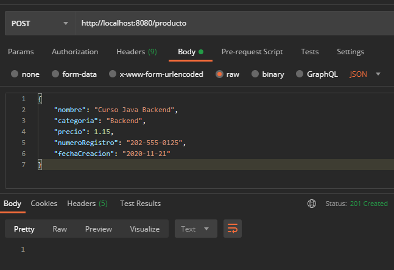
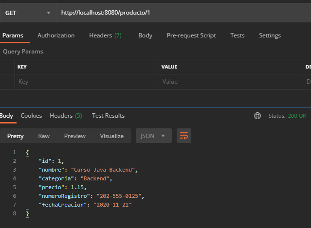

## Reto 1: Persistencia de datos con Spring Data JPA

### Objetivo
- Obtener información almacenada en la base de datos.
- Hacer uso de las anotaciones básicas de JPA para indicar qué objeto debe ser tratado como una entidad de base de datos.
- Aprender qué es un repositorio y los métodos por default que ofrece.

#### Requisitos
- Tener instalado el IDE IntelliJ Idea Community Edition con el plugin de Lombok activado.
- Tener instalada la última versión del JDK 11 (de Oracle u OpenJDK).
- Tener instalada la herramienta Postman.
- Tener instalada la base de datos MySQL y los datos del usuario para conectarse


#### Desarrollo
- Crea un nuevo proyecto usando Spring Initilizr y agrega las dependencias de **Spring Web**, **Lombok**, **Spring Data JPA** y **MySQL Driver**.
- Crea los subpaquetes: `controllers`, `model` y `persistence`
- Crea una clase `Producto` y coloca las anotaciones correspondientes de *Lombok* y *JPA*.
- Crea una clase `ProductoRepository` que extienda de `JpaRepository`.
- Crea una clase `ProductoController` que haga uso de la interface anterior.
  - Implementa las funcionalidades de guardar un nuevo objeto `Producto` usando un método **POST**.
  - Implementa un método **GET** que reciba el ID de un objeto `Producto` y lea el objeto correspondiente de la base de datos. Si no se encuentra el objeto con el ID correspondiente se deberá regresar un error **404**.

<details>
	<summary>Solución</summary>
1. Crea un proyecto Maven usando Spring Initializr desde el IDE IntelliJ Idea.

2. En la ventana que se abre selecciona las siguientes opciones:
- Grupo, artefacto y nombre del proyecto.
- Tipo de proyecto: **Maven Project**.
- Lenguaje: **Java**.
- Forma de empaquetar la aplicación: **jar**.
- **Versión de Java: 11**.

3. En la siguiente ventana elige **Spring Web**, **Lombok**, **Spring Data JPA** y **MySQL Driver** como dependencia del proyecto.

4. Dale un nombre y una ubicación al proyecto y presiona el botón *Finish*.

5. En el proyecto que se acaba de crear debes tener el siguiente paquete `org.bedu.java.backend.sesion6.reto1`. Dentro crea los subpaquetes: `controllers`, `model` y `persistence`.

6. Dentro del paquete `model` crea una clase llamada `Producto` con los siguientes atributos:
```java
    private Long id;
    private String nombre;
    private String categoria;
    private float precio;
    private String numeroRegistro;
    private LocalDate fechaCreacion;
```
7. Decora la clase con la anotación `@Data` de *Lombok*:
```java
@Data
public class Producto {

}
```

8. Decora también la clase con las siguientes anotaciones de JPA:
```java
@Data
@Table (name = "PRODUCTOS")
@Entity
public class Producto {

}
```

9. Decora los atributos `id`, `numeroRegistro` y `fechaCreacion` con las siguientes anotaciones:
```java
    @Id
    @GeneratedValue(strategy = GenerationType.IDENTITY)
    private Long id;
    private String nombre;
    private String categoria;
    private float precio;

    @Column(name = "numero_registro", length = 20)
    private String numeroRegistro;

    @Column(name = "fecha_creacion")
    private LocalDate fechaCreacion;
```

10. En el paquete `persistence` crea una **interface** llamada `ProductoRepository` que extienda de `JpaRepository`. Esta interface permanecerá sin métodos:
```java
public interface ProductoRepository extends JpaRepository<Producto, Long> {

}
```

11. En el paquete `controllers` crea una nueva clase llamada `ProductoController` y decórala con las anotaciones de Spring MVC para indicar que esta clase es un controlador web.
```java
@RestController
@RequestMapping("/producto")
public class ProductoController {

}
```

12. Crea un método **POST** que reciba un objeto `Cliente` como parámetro y regrese un código de respuesta **201** y otro método `getProducto` que reciba el id del producto:
```java
    @PostMapping
    public ResponseEntity<Void> creaProducto(@RequestBody Producto producto){
        return ResponseEntity.created(URI.create()).build();
    }
    
    @GetMapping("/{productoId}")
    public ResponseEntity<Producto> getProducto(@PathVariable Long productoId){
        return ResponseEntity.ok();
    }
```

13. Agrega un atributo `final` de tipo `ProductoRepository`:

```java
private final ProductoRepository productoRepository;
```

14. Usa la anotación `@RequiredArgsConstructor` de *Lombok*.
```java
@RestController
@RequestMapping("/producto")
@RequiredArgsConstructor
public class ProductoController {

    private final ProductoRepository productoRepository;
}
```

15. Dentro del método `creaProducto` usa el objeto `productoRepository` para guardar el objeto en base de datos. Usa el `id` del objeto almacenado para regresarlo en la respuesta del método.
```java
    @PostMapping
    public ResponseEntity<Void> creaProducto(@RequestBody Producto producto){

        Producto productoDB = productoRepository.save(producto);

        return ResponseEntity.created(URI.create(String.valueOf(producto.getId()))).build();
    }
```

16. Dentro del método `getProducto` busca el objeto con el id recibido, si existe regrésalo, sino regregsa un error indicando que el objeto no se ha encontrado.
```java
    @GetMapping("/{productoId}")
    public ResponseEntity<Producto> getProducto(@PathVariable Long productoId){

        Optional<Producto> productoDB = productoRepository.findById(productoId);

        if(!productoDB.isPresent())
            throw new ResponseStatusException(HttpStatus.NOT_FOUND, "El producto especificado no existe.");

        return ResponseEntity.ok(productoDB.get());
    }
```

17. En el directorio resources busca o crea el archivo `application.properties`. Coloca el siguiente contenido en el archivo (los valores entre los signos `<` y `>` reemplazalos con tus propios valores):
```
spring.jpa.hibernate.ddl-auto=update
spring.jpa.hibernate.generate_statistics=true
spring.jpa.properties.hibernate.dialect=org.hibernate.dialect.MySQL5Dialect
spring.datasource.driver-class-name=com.mysql.cj.jdbc.Driver
spring.datasource.url=jdbc:mysql://localhost:3306/bedu?serverTimezone=UTC
spring.datasource.username=<usuario>
spring.datasource.password=<password>
```

18. Ejecuta la aplicación y envía la siguinte petición desde Postman:
```json
{
    "nombre": "Curso Java Backend",
    "categoria": "Backend",
    "precio": 1.15,
    "numeroRegistro": "202-555-0125",
    "fechaCreacion": "2020-11-21"
}
```

debes tener la siguiente respuesta en la consola de Postman:



19. Envía una petición **GET** en Postman con el id **1**. Debes obtener la siguiente respuesta



</details>
